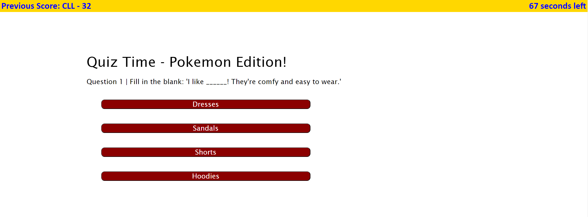

# web-api-code-quiz

## Description

This multiple choice quiz (on one of my favorite topics, Pokemon) gave me a chance to test my skills in web APIs like timers, DOM traversal, and event listeners. The result is a quiz that can be ended under multiple criteria (answer all the questions or run out of time), and that utilizes local storage to store your previous score for future reference.

After this project, I feel a lot more confident using event items to create triggers that carry out the correct flow of events. It took a few tries of scrapping my code altogether before I got a sequence of functions that not only went in the order I intended, but didn't conflict with each other.

## Usage

Once you have loaded [the quiz](https://collylee.github.io/web-api-code-quiz/), press the Start Quiz button to proceed to the first question. Answer the questions as quickly as possible to get the highest score you can. But if you select the wrong answer, 10 seconds/points is deducted from your final score.

Upon completing the fifth question, or running out of time, you will be taken to a screen where you can enter your name or initials to save your score and reset the game. Play the game again, and see if you can beat your previous score!

## Credit

Special thanks to [my brother](https://github.com/IanAHill) for the idea of storing the questions and answers as an object with an array of properties. Also a shout out to my tutor Dennis Itua for helping me work out last minute bugs in the timer and gameOver functions. 